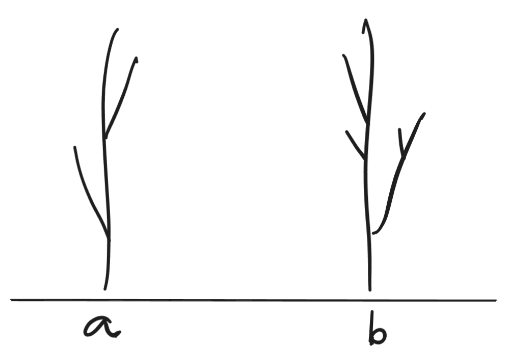
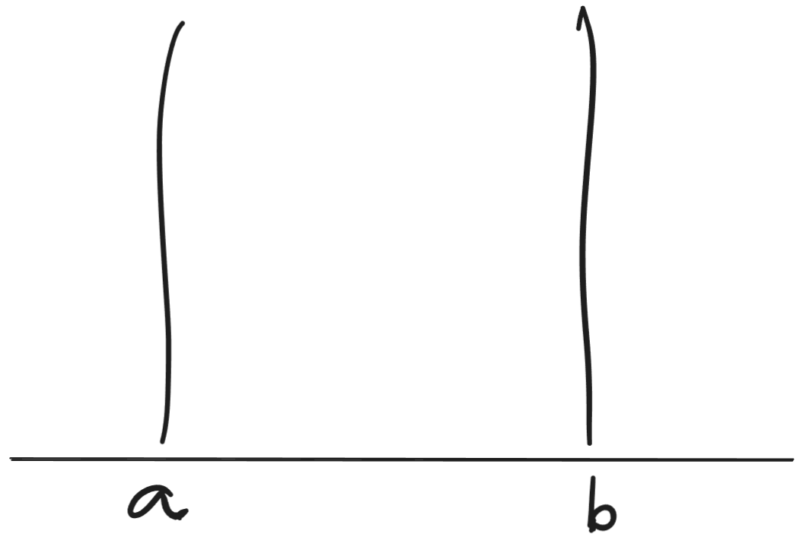

A modelagem matemática opera por abstrações. Cabe nos perguntar se, ao tratar de seres humanos, nós desejamos fazer abstrações.

Abstrações aparam arestas. Imagine as das figuras a seguir. Elas são parecidas, mas possuem algumas diferenças.

{fig-align="center"}

Ao operar realizar uma modelagem matemática delas, entretanto, buscaríamos remover o maior número possível de diferenças, se elas não forem relevantes para os nossos objetivos. Ficariam, então, algo assim:

{fig-align="center"}

Não nos interessam os galhos ou outras idiossincrasias. É perceptível que não são os mesmos objetos: algumas diferenças foram preservadas, mas ambas sofreram considerável homogeneização.

Comparar pessoas é algo parecido. Nós temos que escolher um esquema de comparação, e então as medimos de acordo com esse esquema. Isso é digno faz sentido ao afirmar coisas como "Jimi Hendrix toca guitarra melhor do que meu irmão de 6 anos", pois na métrica "tocar guitarra" é claro que o Jimi Hendrix é superior.

As coisas começam a ficar meio estranhas quando pensamos sobre coisas como "variáveis" psicológicas, como habilidades sociais, depressão ou autoestima. Ora, talvez seja válido afirmar que "Joana é mais deprimida do que Raquel", pois Joana chora todos os dias, sente-se inútil, não tem motivação pra tomar banho, e de tanto ruminar sobre vergonhas passadas sua memória começou a lhe pregar peças. Raquel, por outro lado, parece mais alegre do que nunca: está tocando baixo, viajando com certa frequência, lutando krav magá e recentemente ganhou um aumento. Pelas características exteriores é possível inferir que Joana é mais deprimida do que Raquel.

Talvez não seja realmente assim. Talvez Raquel cometa suicídio, enquanto Joana não, e todos ficariam surpresos. Mas vamos conceder que podemos de fato medir que Joana é mais deprimida que Raquel.

Numa escala de depressão, então, deve haver alguém com o mesmo nível de depressão que Joana. Sejamos o mais criterioso possíveis: não estamos considerando pontuações obtidas numa Escala Beck de Depressão, mas sim um acesso hipotético a algo que não temos acesso ainda: um acesso *direto* à variável latente *depressão*. Ou seja, não estamos medindo a depressão indiretamente por um inventário psicométrico, mas diretamente por meio de algum artifício mágico. [^1]

[^1]: Na avaliação psicológica, testagem psicológica ou psicometria aplicada -- o tipo de teste que você faz quando vai no neuropsicólogo pra saber se tem TDAH ou autismo -- nós medimos indiretamente os níveis das chamadas variáveis latentes (depressão, ansiedade, autismo, TDAH). Os testes são vias de acesso para uma mensuração dessas coisas, às quais nós não temos acesso direto, por meio da teoria das probabilidades (sim, matemática ou, mais especificamente, estatística).

Logo, depressão se tornou para nós uma variável observável.

Então digamos que há duas pessoas. Joana, que está com um nível de depressão $x$, e Júlia, que está localizada na mesma posição da escala, $x$.[^2] Sabemos apenas que elas têm esse tal do mesmo *nível*. Mas isso não nos diz *como* (até certo grau) nem *por quê*. Temos os troncos desnudos da Figura 2, mas nossa medida deixou os galhos da Figura 1 de fora.

[^2]: Rasch (ou Lord e Novick) nos possibilitou(ram) fazer esse tipo de coisa -- só não obtivemos o tal do "acesso direto" ainda (e talvez nunca o façamos).

Talvez possamos descobrir um pouco desse *como*. Podemos, talvez, fazer uma análise de redes a longo prazo (séries temporais) e investigar a dinâmica dos sintomas de Joana e Júlia. Será que serão idênticos? Ou apresentarão diferenças?

Mas ainda assim, o conjunto de descobertas possíveis nessa investigação estará limitada ao conjunto de configurações possíveis da entidade da Figura 2: nossa medida nunca terá acesso aos galhos da Figura 1, pois eles são exógenos à medida.

O problema é que cada depressão tem um colorido específico. Os galhos, os extras -- a conexão com a história individual, a gota d'água que deu início a esse "episódio" depressivo, etc. Nesse sentido, a abstração apara arestas demais.

Mas talvez queiramos descobrir o que há de comum entre muitos. Como é que, ignorando as diferenças individuais, nós podemos descobrir sobre como a depressão funciona? E aí precisamos sim aparar as arestas, cortas os galhos, porque eles são excessivamente peculiares aos troncos individuais em que originalmente se encontram.

Psicometria, portanto, é uma maravilhosa ferramenta de pesquisa -- mas na clínica não há nada melhor do que a escuta e a fala.